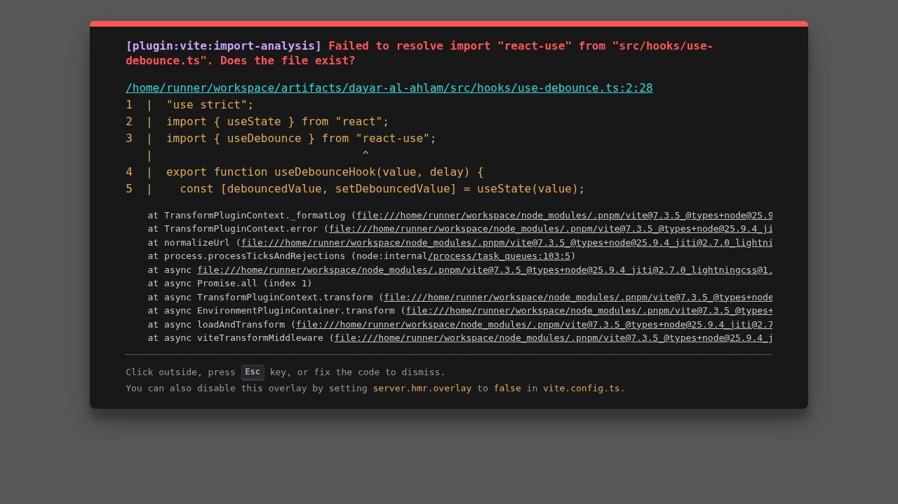

<p align="center">
  
</p>

# Dayar Al-Ahlam

> Premier luxury real estate and apartment rental platform engineered for high-end properties, featuring full right-to-left (RTL) Arabic localization, interactive search and filtering, and a comprehensive administrative portal.

---

## Overview

Dayar Al-Ahlam is a full-stack real estate web application tailored for luxury residential rentals and property showcase. Built with a modern TypeScript monorepo architecture, the platform pairs a dynamic, responsive client interface with an Express-powered REST API and PostgreSQL database backed by Drizzle ORM.

The platform provides end users with property search, multi-criteria filtering across Egyptian metropolitan regions, image carousels, and tiered pricing structures (daily, weekly, monthly). Property administrators have access to a secure management portal to publish new listings, update availability, upload imagery, and monitor key operational metrics.

<p align="center">
  
</p>

---

## Key Features

### Public Portal
- Native Arabic RTL Experience: Built ground-up for right-to-left layout conventions, typography powered by Cairo, and a responsive luxury dark aesthetic with gold accents.
- Advanced Listing Search: Instant searching and filtering by city, district, availability status, and price range.
- Comprehensive Apartment Profiles: Dedicated property views featuring image galleries, detailed amenity lists, room breakdowns, geographic details, and multi-tier rental pricing tables (per day, per week, per month).
- Direct Contact and Booking Inquiries: Integrated action channels allowing prospective tenants to initiate direct inquiries via WhatsApp or phone.
- Responsive Design: Optimized for seamless operation across desktop workstations, tablets, and mobile devices.

### Administrative Management
- Secure Authentication: Password-protected session management for authorized platform administrators.
- Listing Lifecycle Operations: Create, edit, inspect, and remove apartment units.
- Real-Time Status Toggles: Update apartment status between available and unavailable with instant storefront reflection.
- Media Upload Pipeline: Integrated file upload endpoint supporting image storage for apartment galleries.
- Platform Analytics: Overview counters tracking aggregate apartments, active inventory, and geographical distribution.

---

## Tech Stack

### Monorepo and Tooling
- Package Manager: pnpm workspaces
- Language: TypeScript 5.9
- Runtime: Node.js 24+

### Frontend Application (`@workspace/dayar-al-ahlam`)
- Framework: React 19
- Build Tool: Vite 6
- Styling: Tailwind CSS 4 with custom design tokens
- Animation: Framer Motion
- UI Primitives: Radix UI component primitives
- Routing: Wouter
- Data Fetching: TanStack React Query
- Form Handling: React Hook Form with Zod schema resolution

### Backend API (`@workspace/api-server`)
- Framework: Express 5
- Session Management: cookie-session with signed cryptographic cookies
- Logging: Pino and pino-http
- File Ingestion: Multer
- Bundler: esbuild

### Data Layer (`@workspace/db`)
- Database: PostgreSQL
- ORM: Drizzle ORM
- Migrations and Schema Synchronization: Drizzle Kit
- Schema Validation: drizzle-zod

### Contracts and Code Generation (`@workspace/api-spec`, `@workspace/api-zod`, `@workspace/api-client-react`)
- API Specification: OpenAPI 3.1
- Client Code Generation: Orval for type-safe TanStack Query client generation
- Type Validation: Zod schemas derived from OpenAPI specifications

---

## Project Structure

```text
dayar/
├── .env.example                     # Environment configuration template
├── .gitignore                       # Multi-tier exclusion rules
├── LICENSE                          # MIT License
├── package.json                     # Workspace root configuration
├── pnpm-lock.yaml                   # Dependency lockfile
├── pnpm-workspace.yaml              # pnpm workspace definition
├── tsconfig.base.json               # Shared TypeScript base configuration
│
├── artifacts/
│   ├── api-server/                  # Express 5 REST API microservice
│   │   ├── src/
│   │   │   ├── routes/              # Modular route controllers
│   │   │   ├── middlewares/         # Session and validation middlewares
│   │   │   ├── app.ts               # Express application initialization
│   │   │   └── index.ts             # Server entry point
│   │   └── package.json
│   │
│   └── dayar-al-ahlam/              # React frontend application
│       ├── public/                  # Static assets and site icons
│       ├── src/
│       │   ├── components/          # Reusable UI and admin components
│       │   ├── contexts/            # Application state and theme providers
│       │   ├── pages/               # Top-level view routes
│       │   └── index.css            # Global CSS styles and design system
│       ├── index.html               # HTML entry point (dir="rtl")
│       └── vite.config.ts           # Vite build pipeline configuration
│
├── lib/
│   ├── api-client-react/            # Generated React Query API client
│   ├── api-spec/                    # OpenAPI 3.1 specification & Orval configs
│   │   └── openapi.yaml             # API contract (single source of truth)
│   ├── api-zod/                     # Generated Zod validation models
│   └── db/                          # Database connection and Drizzle schemas
│       ├── src/
│       │   ├── schema/              # Table schemas (apartments, users)
│       │   └── index.ts             # Drizzle instance connection
│       ├── drizzle.config.ts        # Drizzle kit configuration
│       └── seed.mjs                 # Database seeder utility
│
└── attached_assets/                 # Vector brand logos and design mockups
```

---

## Getting Started

### Prerequisites

Ensure the following runtimes and utilities are installed on your machine:
- Node.js (version 20 or higher, version 24 recommended)
- pnpm (version 9 or higher, version 11 recommended)
- PostgreSQL database instance (local server or cloud instance such as Neon)

### Installation

1. Clone the repository:
   ```bash
   git clone https://github.com/yezen57/dayar.git
   cd dayar
   ```

2. Install workspace dependencies:
   ```bash
   pnpm install
   ```

3. Configure environment variables:
   Copy the `.env.example` template to `.env`:
   ```bash
   cp .env.example .env
   ```

4. Synchronize database schema and seed initial listings:
   ```bash
   # Push Drizzle schema to the target PostgreSQL database
   pnpm --filter @workspace/db run push

   # Optional: Populate initial demonstration properties
   node ./lib/db/seed.mjs
   ```

5. Launch development services:
   ```bash
   # Terminal 1: Run the API backend (default port 5000)
   pnpm --filter @workspace/api-server run dev

   # Terminal 2: Run the frontend application (default port 5173)
   pnpm --filter @workspace/dayar-al-ahlam run dev
   ```

6. Open your web browser:
   - Public Website: `http://localhost:5173`
   - Administrative Dashboard: `http://localhost:5173/admin`

---

## Scripts

The root and sub-packages provide the following management scripts:

| Command | Scope | Description |
|---|---|---|
| `pnpm run build` | Workspace | Runs complete type checks and builds all workspace packages. |
| `pnpm run typecheck` | Workspace | Validates TypeScript compilation across all submodules. |
| `pnpm --filter @workspace/dayar-al-ahlam run dev` | Frontend | Launches the Vite frontend development server. |
| `pnpm --filter @workspace/dayar-al-ahlam run build` | Frontend | Compiles the client application into the production bundle. |
| `pnpm --filter @workspace/api-server run dev` | API Server | Runs the Express API server with automatic compilation. |
| `pnpm --filter @workspace/api-server run build` | API Server | Bundles the backend using esbuild. |
| `pnpm --filter @workspace/db run push` | Database | Pushes Drizzle schema modifications to the connected database. |
| `pnpm --filter @workspace/api-spec run codegen` | API Contracts | Generates React Query hooks and Zod schemas from `openapi.yaml`. |

---

## Configuration

All runtime configurations are handled through environment variables defined in `.env`:

| Variable | Required | Default | Description |
|---|---|---|---|
| `DATABASE_URL` | Yes | - | PostgreSQL connection string (including SSL mode if remote). |
| `SESSION_SECRET` | Yes | - | Cryptographic salt used for signing administrator session cookies. |
| `PORT` | No | `5173` | Local port bound by Vite for the client interface. |
| `API_PORT` | No | `5000` | Local port bound by Express for the REST API. |
| `BASE_PATH` | No | `/` | Base URL path for routing. |
| `ADMIN_USERNAME` | No | `admin` | Username for administrative portal authentication. |
| `ADMIN_PASSWORD` | No | - | Password for administrative portal authentication. |

---

## Limitations & Roadmap

### Current Limitations
- Media Storage: Uploaded images are stored on the local filesystem directory rather than an external object storage service (e.g., AWS S3 or Cloudflare R2).
- Single Admin Model: Authentication currently validates a single administrative credential set rather than a multi-user role-based database.

### Planned Roadmap
- Cloud Object Storage: Migration of file handling to S3-compatible cloud storage with CDN distribution.
- Role-Based Access Control (RBAC): Implementation of multi-tenant administrative roles and activity audit logs.
- Direct In-App Booking: Integration with payment gateways (e.g., Paymob, Stripe) for automated rental deposits.
- Multilingual Internationalization: English language toggle alongside the primary Arabic localization.
- Advanced Geolocation: Interactive map view with district boundary highlights and radius searching.

---

## License

This project is distributed under the terms of the MIT License. See the [LICENSE](./LICENSE) file for complete details.
